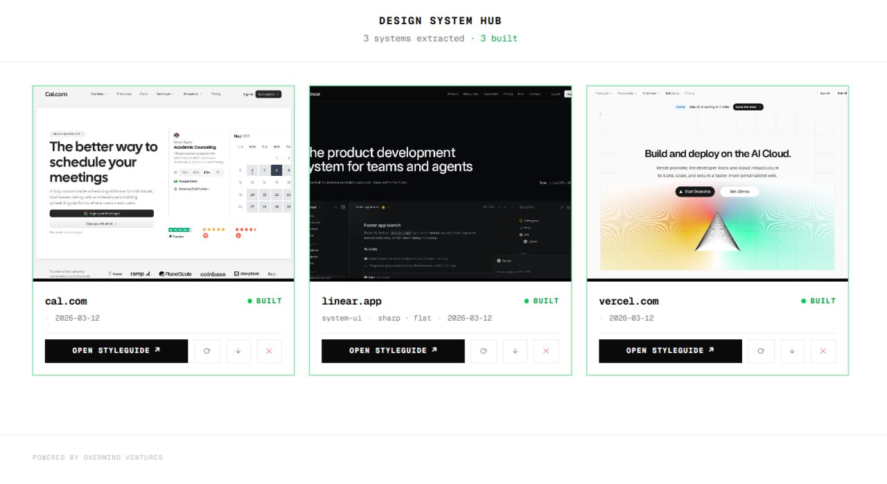
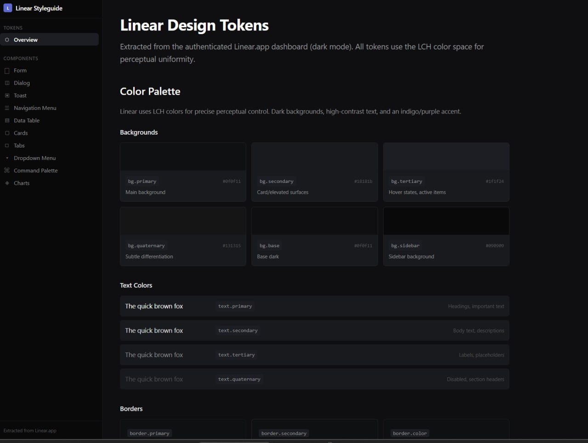

# DesignKit — Design System Extraction Hub

Extract real design tokens from web applications and generate complete styleguide projects with component libraries.

**Live demo:** [designkit.overmind.ventures](https://designkit.overmind.ventures)



## What is this?

DesignKit is an AI-powered tool that reverse-engineers design systems from live web applications. It extracts actual CSS tokens (colors, typography, spacing, shadows, radius) and generates complete Next.js + shadcn/ui styleguide projects with 10+ component showcases.



## 🔑 App-First Extraction

**The key insight: extract from the authenticated app UI, not landing pages.**

Landing pages use marketing-specific styles that don't represent the real product design system. DesignKit authenticates into the actual application (dashboard, settings, forms) and extracts the real tokens used by the product.

This produces dramatically better results because:
- App tokens are the actual design system (not one-off marketing styles)
- You get semantic tokens (success, error, warning, not just colors)
- Component patterns match real usage
- Dark mode support is real, not approximated
- Typography and spacing follow the product's actual scale

> **When an AI agent has access to the authenticated application, the extraction quality is significantly higher than any public page analysis.**

The landing page is captured only as a screenshot thumbnail for the hub card.

## Architecture

```
design-system-hub/
  ├── app/                ← Hub Next.js app (panel + API routes)
  ├── lib/                ← process-manager, design-meta
  ├── scripts/
  │   ├── generate-portable.cjs   ← creates framework-agnostic token packages
  │   └── screenshot.cjs          ← captures LP screenshots via Playwright
  ├── extractions/        ← raw browser-extracted tokens per domain
  ├── styleguides/        ← dedicated Next.js + shadcn projects per domain
  ├── portable/           ← portable token packages (JSON, CSS, Tailwind preset)
  ├── static/             ← symlinks to styleguide static exports
  └── public/screenshots/ ← LP screenshots for hub cards
```

## How it works

### 1. Authenticate into the app
Open the target app in a browser. Sign up or log in. Navigate to the dashboard.

### 2. Extract tokens via JavaScript
Run CSS variable extraction on 3-5 representative pages (dashboard, settings, forms, detail views). This captures all `--color-*`, `--font-*`, `--radius-*`, `--shadow-*` and computed styles.

### 3. Generate styleguide
Create a dedicated Next.js + shadcn/ui project with:
- **Token showcase** — colors, typography, radius, shadows, design summary
- **10 component pages** — Form, Dialog, Toast, Navigation, Data Table, Cards, Tabs, Dropdown, Command Palette, Charts
- **Dark mode** — full light/dark toggle with real dark tokens
- **Sidebar navigation** — organized by section

### 4. Build & serve
Static export via `next build` (output: "export"). Served by nginx. Zero running processes per styleguide.

### 5. Portable tokens
Framework-agnostic token packages: `tokens.json`, `tokens.css`, `tailwind.preset.js`, `README.md`.

## Extracted examples

| App | Tokens | Components | Dark Mode |
|-----|--------|------------|-----------|
| Cal.com | Inter, #292929, 0.625rem radius, 250+ vars | 10 | ✅ |
| Linear | Inter, #0b0b0d, 8px radius, lch() colors | 10 | ✅ |
| Vercel | Geist, #0070f3, 6px radius, 365 vars | 10 | ✅ |

## Hub features

- Grid view with LP screenshot thumbnails
- Build & rebuild styleguides
- Download portable token packages (tar.gz)
- Delete styleguides
- Color identity swatch per card
- Design metadata (font, style, date)

## Deployment

- **Server:** Any VPS with Node.js 18+
- **Hub:** `npx next build && npx next start -p 3100`
- **SSL:** nginx reverse proxy + Let's Encrypt
- **Styleguides:** nginx serves static exports from `/s/<domain>/`
- **Screenshots:** nginx serves from `/screenshots/` (bypasses Next.js for `.com.jpg` paths)

## AI Agent Skill

This project is designed to be used as a skill for AI agents (OpenClaw, Claude Code, etc.). See `skill/SKILL.md` for the full instruction set that teaches an AI agent how to:
- Authenticate into web apps
- Extract CSS tokens via browser JavaScript
- Map tokens to shadcn theme structure
- Generate complete styleguide projects
- Handle lch()/oklch() color spaces
- Build and serve static exports

## Tech stack

- Next.js 16 + TypeScript
- Tailwind CSS v4
- shadcn/ui (v2, base-ui)
- Playwright (screenshots)
- nginx (reverse proxy + static serving)

## License

MIT
